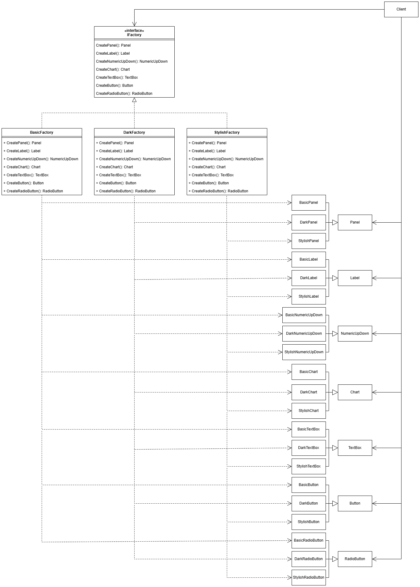
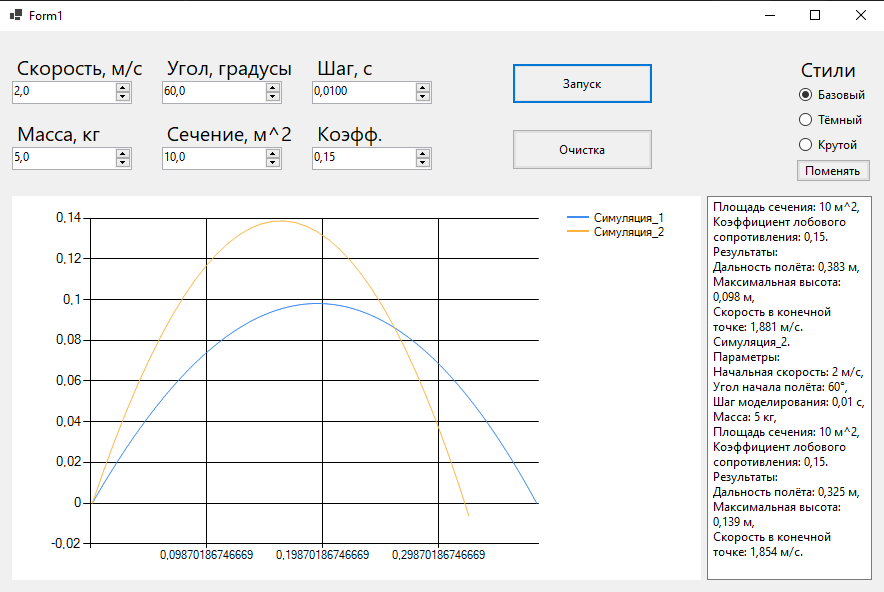
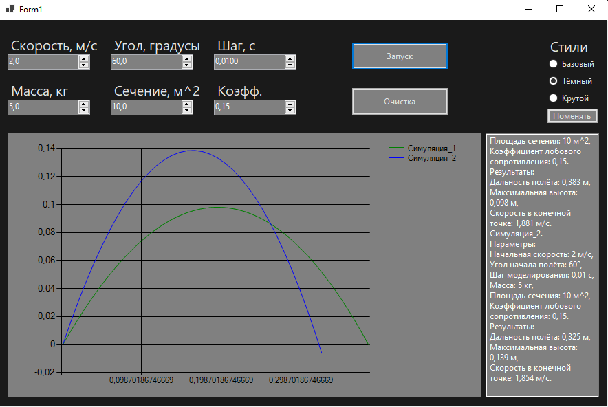
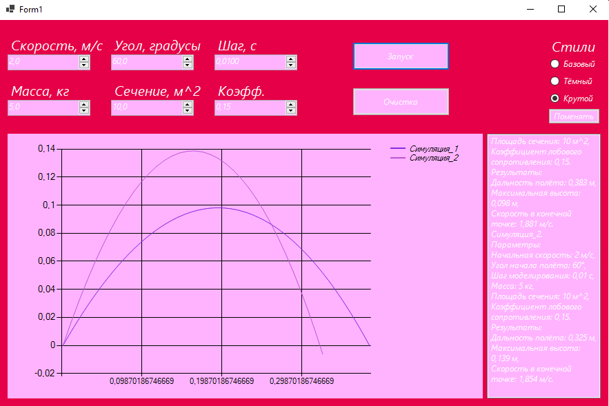

## Лабораторная работа №1
### Проблема
Нужно спроектировать возможность изменения темы приложения (светлая, тёмная и т.д.).  
Если какая-то тема выбрана, то ей должны соответствовать все элементы приложения (Кнопки, текст, поля ввода и т.д.).  
При проектировании приложения предусмотреть возможность добавления новых тем или элементов приложения в будущем.  
### Решение  
Паттерн **Абстрактная фабрика** идеально подходит для решения данной проблемы.  
Создадим интерфейс IFactory, который будет содержать в себе операции для создания каждого необходимого элемента.  
Также создадим реализации этого интерфейса для каждого стиля (в данном случае стиля три: Basic, Dark, Stylish).  
Каждая реализация будет создавать элементы своего стиля, например: BasicFactory будет создавать BasicPanel, BasicButton и т.д.  
Диаграмма классов для данного приложения:  
  
Интерфейс приложения в разных стилях:  
  
  
  
### Вывод  
Паттерн **Абстрактная фабрика** позволяет реализовать такой механизм создания связанных объектов,  
что при необходимости разработчик может без каких-либо проблем дополнить программу новыми "группами" объектов,  
или изменить реализацию уже существующих "групп" с помощью отдельных классов, не затрагивая  
уже существующий "клиентский" код.  
