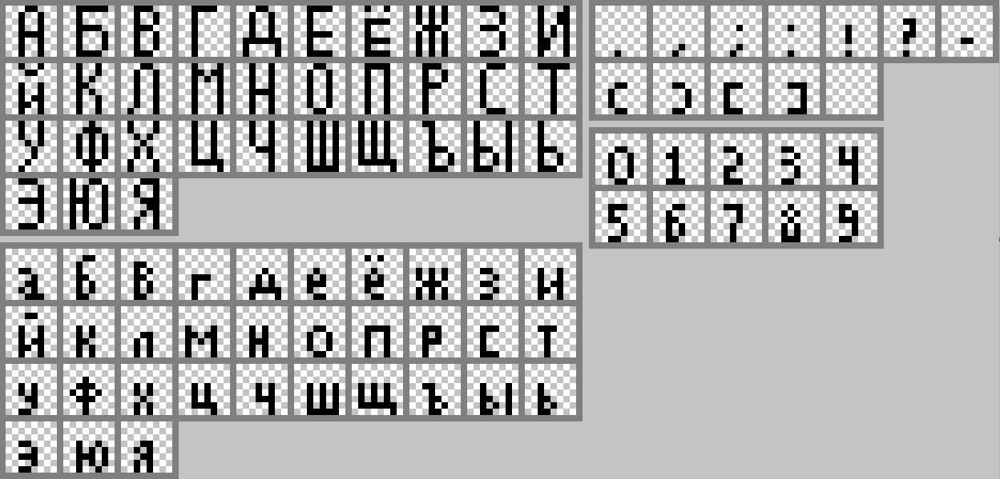
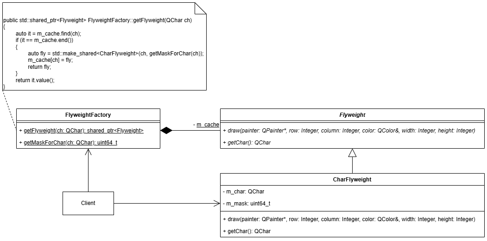
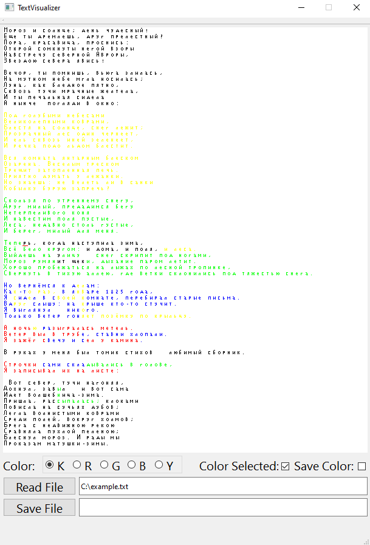
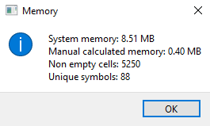
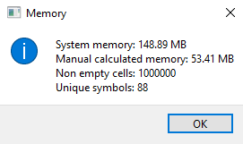
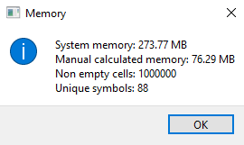

## Лабораторная работа №2  
### Проблема  
Нужно спроектировать простой текстовый редактор на **C++**,  
реализовав графический интерфейс с помощью **Qt**,  
отрисовывающий все символы по заранее заданным битовым картам,  
а также имеющий возможность изменять цвет символам.  
### Решение  
Будем хранить каждый символ как отдельный объект.  
Создадим битовые карты размером **8x8** для каждого из символов, которые  
будут поддерживаться приложением:  
  
Но так-как количество поддерживаемых символов ограниченно (*в данном случае их всего 88*),  
то хранить в каждом объекте-символе символ, который тот представляет и  
соответствующую битовую карту нерационально.  
Используем паттерн **Приспособленец**.  
Разделим каждый объект-символ на две части: внутреннюю и внешнюю.  
Внутренняя часть будет хранить общие данные для всех объектов-символов,  
представляющий один и тот же символ (*в данном случае общими данными  
будут представляемый символ и соответствующая битовая карта*).  
Внешняя часть будет хранить уникальные для каждого объекта-символа данные  
(*в данном случае уникальными данными будут расположение на полотне  
и цвет символа*).  
Тогда напишем абстрактный класс *Flyweight*:  
```cpp
class Flyweight
{
public:
	virtual ~Flyweight() = default;
	virtual void draw(QPainter* painter, int row, int column, const QColor& color, int width = 8, int height = 8) const = 0;
	virtual QChar getChar() const = 0;
};
```  
а также его реализацию для объектов-символов *FlyweightChar*:  
```cpp
class CharFlyweight : public Flyweight
{
public:
	CharFlyweight(QChar ch, uint64_t mask = 0) : m_char(ch), m_mask(mask) {}
	QChar getChar() const;
	void draw(QPainter* painter, int row, int column, const QColor& color, int width = 8, int height = 8) const override;
private:
	QChar m_char;
	uint64_t m_mask;
};
```  
**FlyweightChar** будет хранить внутреннюю часть, общую для  
нескольких объектов-символов (*Представляемый символ - m_char  
и битовая карта - m_mask*).  
Также напишем класс-фабрику *FlyweightFactory*,  
имеющую **статическое** поле:  
```cpp
QHash<QChar, std::shared_ptr<Flyweight>> FlyweightFactory::m_cache
```  
Данное поле будет хранить ссылки на объекты, представляющие  
внутреннюю часть объектов-символов.  
Добавим в класс-фабрику метод:  
```cpp
std::shared_ptr<Flyweight> FlyweightFactory::getFlyweight(QChar ch)
{
	auto it = m_cache.find(ch);
	if (it == m_cache.end())
	{
		auto fly = std::make_shared<CharFlyweight>(ch, getMaskForChar(ch));
		m_cache[ch] = fly;
		return fly;
	}
	return it.value();
}
```  
Метод будет проверять - кэширована ли внутренняя часть для представления  
заданного символа *ch*. Если внутренняя часть кэширована - она возвращается,  
иначе - внутренняя часть сначала создаётся и кэшируется, а после возвращается.  
Получившаяся диаграмма классов для паттерна **Приспособленец**:  
  
Получившийся интерфейс приложения:  
  
Приложение способно считывать текстовые файлы и выводить их на полотно.  
Полотно - интерактивно, пользователь может перемещаться по нему нажатием мыши или стрелочками,  
а также добавлять/удалять символы. Также пользователь может выбирать цвет, которым  
будут отрисованы символы. Приложение имеет возможность сохранения получившегося текста в  
файл с сохранением цветовых тегов, которые при считывании этого файла повторно  
корректно отобразят цвета символов.  
Так как битовые карты размером **8x8** довольно легковесны, то разница потребляемой  
приложением памяти с использование паттерна **Приспособленец** и без будет не так заметна.  
Для наглядности, чтобы не менять размерность битовых карт,  
добавим в внутреннюю часть объектов-символов строку:  
```cpp
QString demoWeight = "DEMO WEIGHT";
```  
За счёт этой строки внутренняя часть требует большего количества памяти и разница  
в эффективности потребления памяти с использованием паттерна и без станет очевидна.  
Посчитаем потребление памяти всем приложением (*System memory*),  
объектами-символами (*Manual calculated memory*), а также количество  
объектов-символов (*Non empty cells*) и количество уникальных  
символов, представленных в тексте (*Unique symbols*).  
Потребление памяти приложением при полном заполнении полотна размером **70x75**:  
С применением паттерна:  
  
Без применения паттерна:  
  
Чтобы сделать разницу ещё более наглядной увеличим количество считываемых  
приложением символов до **1000x1000** (*На полотно будет отображено только **70x75** символов*).  
Тогда потребление памяти приложением:  
С применением паттерна:  
  
Без применения паттерна:  
  
Как видим разница существенна и увеличивается с увеличением количества символов!  
## Вывод  
Был реализован простой текстовый редактор, с возможностями  
считывания текстовых файлов, редактирования текста, изменения цвета символов  
и сохранения получившегося текста в файл.  
При создании приложения был применён паттерн **Приспособленец**,  
позволяющий повысить эффективность потребления памяти приложением.
