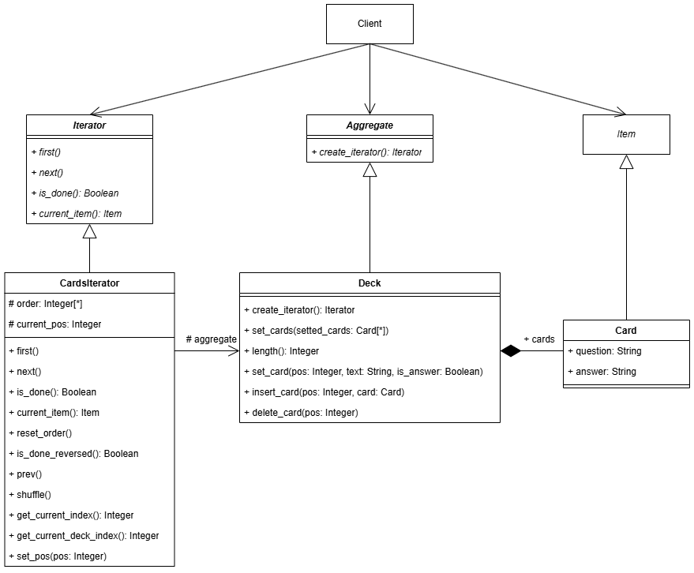
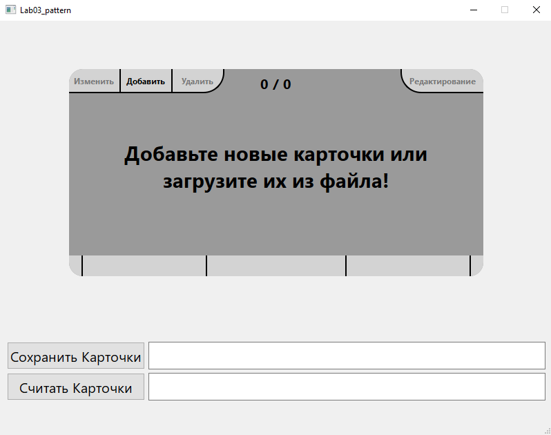
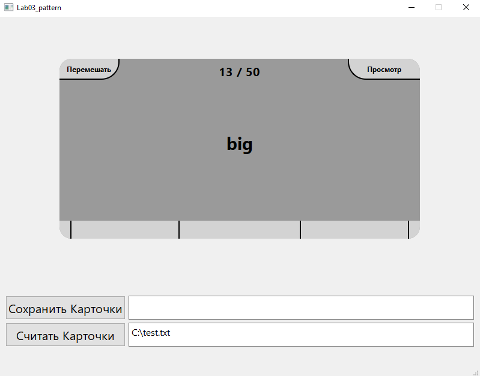

## Лабораторная работа №3  
### Проблема  
Нужно спроектировать приложение на **Python**,  
позволяющее с помощью флеш-карточек запоминать что-либо.  
Графический интерфейс реализовать с помощью **PySide6**.  
Приложение должно иметь возможности перелистывания карточек,  
их переворота (*открытия ответа на карточку*), а также  
создания, редактирования и удаления карточек.  
### Решение  
Для того, чтобы карточки можно было удобно перелистывать,  
используем поведенческий паттерн **Итератор**.  
Диаграмма классов для применения **Итератора** в приложении:  
  
Паттерн позволяет способствовать более логичному разделению  
обязаностей, когда агрегатор в виде колоды карт *Deck* занимается  
в основном хранением и модификацией карт *Card*,  
в то время как перебор этих карт отдаётся итератору *CardsIterator*.  
Интерфейс приложения при запуске:  
  
Интерфейс приложения после считывания файла и пролистывания пары карточек:  
  
Приоложение позволяет считывать карточки из файлов, перелистывать их и  
переворачивать (*открывать ответы на карточки*), а также редактировать, добавлять  
и удалять их. Также карточки можно записать в файл для хранения.
### Вывод  
Было реализовано простое приложения с флеш-карточками,  
помогающее запоминать что-либо.  
При написании приложения был применён поведенческий паттерн **Итератор**,  
позволяющий более удобно и логично реализовать перебор карточек.  
